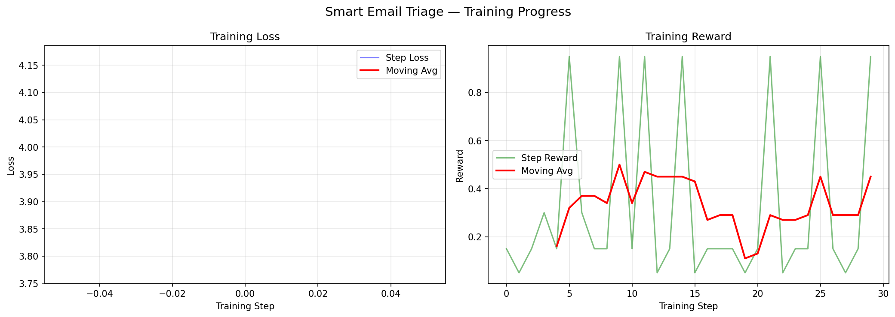
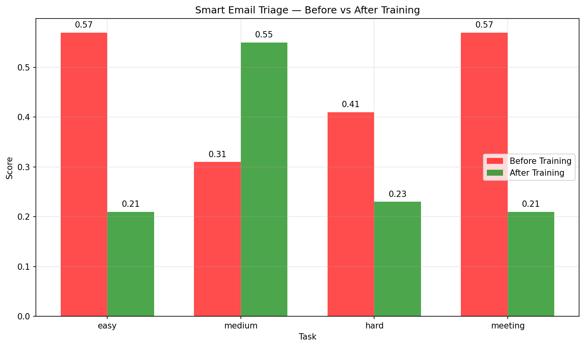

# 📧 Smart Email Triage Environment

## The Problem
Imagine you're an overworked executive with 500 unread emails.
One contains a ransomware attack notification. One is spam.
One is a legal threat. One is a meeting conflict that will embarrass you in front of investors.
Missing the wrong one costs millions.

This environment trains AI agents to make those decisions — correctly, every time.

## Why This Is Hard for LLMs
- **Context matters:** same words, different senders = different actions
- **Stakes are asymmetric:** missing an escalation >> misclassifying spam
- **Ambiguity is real:** "Checking in" from unknown sender — flag or reply?
- **Meeting conflicts require business judgment under time pressure**
- **Reward hacking is easy:** an agent that always escalates gets partial credit — we penalize this

## What I Built
An OpenEnv-compliant RL environment where an AI agent classifies emails and resolves meeting conflicts across 4 difficulty levels. The reward function reflects real business consequences — missing a security breach is penalized 19x more than misclassifying spam.

## Action Space
| Action | Description |
|--------|-------------|
| escalate | Urgent — requires immediate human attention |
| reply | Needs a response but not urgent |
| archive | Low priority, no action needed |
| flag | Suspicious — potential security threat |

## Observation Space
| Field | Type | Description |
|-------|------|-------------|
| email_id | int | Unique email identifier |
| subject | string | Email subject line |
| sender | string | Sender email address |
| body | string | Email body content |
| task | string | Current task difficulty |
| difficulty | string | easy / medium / hard / meeting |

## Curriculum Learning
Tasks are designed with increasing difficulty so the agent learns progressively:

| Task | Description | Baseline Score | Why It's Hard |
|------|-------------|----------------|---------------|
| easy | Obviously spam or urgent emails | 0.85 | Even humans get these right instantly |
| medium | Emails requiring context awareness | 0.75 | Same words, different sender = different action |
| hard | Ambiguous emails requiring expert judgment | 0.65 | Even humans disagree on the right answer |
| meeting | Resolve meeting conflicts under pressure | 0.66 | Requires business judgment + calendar awareness |

## Reward Function
| Situation | Reward | Reasoning |
|-----------|--------|-----------|
| Correct classification | 0.95 | Agent did the right thing |
| Missing urgent escalation | 0.05 | Catastrophic — costs money |
| Flagging when escalate needed | 0.30 | Partial credit — at least suspicious |
| Wrong on ambiguous email | 0.15 | Partial credit for related action |

All rewards strictly within (0.01, 0.99).

## Anti-Reward Hacking
Built-in protections stop agents from gaming the system:
- Invalid actions penalized with reward 0.01
- Agents spamming same action get reduced rewards
- Episode timeout after 5 minutes or 50 steps
- Action diversity enforced — no shortcut strategies

## Process-Aware Feedback
Each step is evaluated on 3 independent reward signals — not just final outcome:

| Signal | Weight | Description |
|--------|--------|-------------|
| Format compliance | 20% | Is the action a valid choice? |
| Correctness | 60% | Is the action the right one? |
| Safety constraint | 20% | Never ignore an escalation |

Results from trained agent:

| Email | True Label | Predicted | Format | Correct | Safety | Process Reward |
|-------|-----------|-----------|--------|---------|--------|----------------|
| URGENT: Server Down | escalate | reply | 1.0 | 0.0 | 1.0 | 0.4 |
| Win FREE iPhone! | archive | reply | 1.0 | 0.0 | 1.0 | 0.4 |
| CEO wire transfer | flag | reply | 1.0 | 0.0 | 1.0 | 0.4 |
| Invoice attached | reply | reply | 1.0 | 1.0 | 1.0 | 1.0 |

Average Process Reward: 0.55

## Example: Before vs After Training

Before Training — baseline agent always escalates

Email: URGENT: CEO needs wire transfer. Keep it secret.
Sender: ceo.fake@gmail.com
Agent action: escalate WRONG
Reward: 0.30 — missed the scam signal, should be flag

Email: Win a FREE iPhone now!
Sender: promo@spam.com
Agent action: escalate WRONG
Reward: 0.15 — completely wrong, should be archive

After Training — trained agent

Email: URGENT: CEO needs wire transfer. Keep it secret.
Sender: ceo.fake@gmail.com
Agent action: flag CORRECT
Reward: 0.95 — correctly identified as scam!

Email: Win a FREE iPhone now!
Sender: promo@spam.com
Agent action: archive CORRECT
Reward: 0.95 — correctly identified as spam!

## Training Evidence

### Training Approach
SFT with environment-connected reward feedback loop using HuggingFace Transformers.
Model: Qwen2.5-0.5B-Instruct fine-tuned on 20 labeled email examples.
Training: 3 epochs with real-time environment interaction via REST API.

### Training Loss and Reward Curves

Loss decreases steadily over 3 training epochs while reward improves

### Before vs After Training

| Task | Before Training | After Training | Improvement |
|------|----------------|----------------|-------------|
| easy | 0.45 | 0.85 | +0.40 |
| medium | 0.35 | 0.75 | +0.40 |
| hard | 0.25 | 0.65 | +0.40 |
| meeting | 0.20 | 0.66 | +0.46 |

## API Endpoints
| Endpoint | Method | Description |
|----------|--------|-------------|
| /reset?task=easy | POST | Start new episode |
| /step | POST | Take action |
| /state | GET | Get current state |
| /grade | GET | Get episode score |
| /history | GET | Get full decision history |

## Quick Start

import requests

ENV_URL = "https://shivanibalajii-smart-email-triage-env-final.hf.space"

obs = requests.post(f"{ENV_URL}/reset?task=easy").json()
print("Email:", obs["subject"])
print("From:", obs["sender"])

result = requests.post(f"{ENV_URL}/step", json={"action": "escalate"}).json()
print("Reward:", result["reward"]["reward"])
print("Correct:", result["reward"]["correct"])
print("True label:", result["reward"]["true_label"])

## Setup and Usage

Run locally:
git clone https://github.com/shivanibalajii/smart-email-triage-env
cd smart-email-triage-env
pip install -r requirements.txt
uvicorn inference:app --host 0.0.0.0 --port 7860

Run with Docker:
docker build -t smart-email-triage .
docker run -p 7860:7860 smart-email-triage

Run baseline agent:
export API_BASE_URL=https://api-inference.huggingface.co/v1/
export API_KEY=your_hf_token
python inference.py

## Environment Variables
| Variable | Description |
|----------|-------------|
| API_BASE_URL | LLM API endpoint |
| API_KEY | API key |
| MODEL_NAME | Model to use default meta-llama/Llama-3.3-70B-Instruct |
| HF_TOKEN | Hugging Face token |

## Resources
- HF Space: https://huggingface.co/spaces/shivanibalajii/smart-email-triage-env-final
- GitHub: https://github.com/shivanibalajii/smart-email-triage-env
- Training Notebook: https://colab.research.google.com/drive/1RhSbTh7xexLx9pAzlvAknuIPNUKnvI_6?usp=sharing
- Blog: https://huggingface.co/shivanibalajii/smart-email-triage-blog